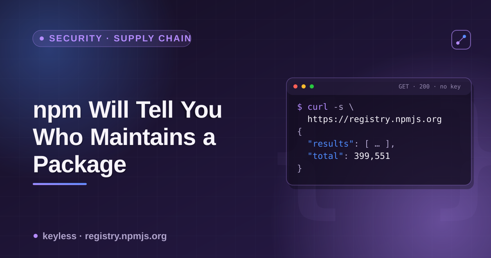

# npm, PyPI & crates.io maintainer/ownership data — a cheatsheet



All three major package registries expose package metadata over free, keyless JSON. What they expose about **who currently has push access** — the field that matters for supply-chain risk — differs a lot between them. This is the reference for that specific slice: which field to read, on which registry, and what it does *not* tell you.

## Maintainer / owner fields, by registry

| Registry | Endpoint | Field | What it actually is |
|---|---|---|---|
| npm | `GET https://registry.npmjs.org/{name}` | `maintainers[]` (`{name, email}`) | **Enforced.** These are real npm accounts with publish rights on the package, right now. |
| PyPI | `GET https://pypi.org/pypi/{name}/json` | `info.maintainer`, `info.maintainer_email`, `info.author`, `info.author_email` | **Not enforced.** Free-text strings set by whoever last published a release. Not tied to accounts with upload rights — PyPI's real access-control list isn't exposed by this endpoint at all. |
| crates.io (sparse index) | `GET https://index.crates.io/{path}` | — | **Absent.** Each line is a version record (`vers`, `deps`, `cksum`, `features`, `yanked`, `pubtime`) with no owner/maintainer field. |
| crates.io (REST) | `GET https://crates.io/api/v1/crates/{name}/owners` | owner list | The actual enforced owner data lives here, on the separate REST API — not the sparse index `cargo` itself uses. |

```bash
# npm — real, enforced maintainer accounts
curl -s https://registry.npmjs.org/chalk | python3 -c \
  "import json,sys; print([m['name'] for m in json.load(sys.stdin)['maintainers']])"

# PyPI — free-text fields, not an access-control list
curl -s https://pypi.org/pypi/requests/json | python3 -c \
  "import json,sys; d=json.load(sys.stdin)['info']; print(d['maintainer'], '|', d['maintainer_email'])"

# crates.io sparse index — no owner field, just version history
curl -s https://index.crates.io/se/rd/serde | tail -1 | python3 -c \
  "import json,sys; d=json.load(sys.stdin); print(d['name'], d['vers'], d['pubtime'])"
```

## Reading the npm `maintainers[]` field for signal

```bash
name=left-pad
curl -s "https://registry.npmjs.org/$name" | python3 -c "
import json, sys
d = json.load(sys.stdin)
print('maintainers:', len(d['maintainers']), [m['name'] for m in d['maintainers']])
print('created:', d['time']['created'])
print('modified:', d['time']['modified'])
print('versions:', len(d['versions']))
"
```

- `maintainers.length` — a crude single-point-of-failure proxy. Low isn't automatically bad (most 1-maintainer packages are fine); it just means one phished credential is enough.
- `time.created` vs `time.modified` — age and last-publish date. A long-abandoned package with a sudden new publish after years of silence is a classic pre-compromise pattern worth a second look.
- This field has **no history** — it's a snapshot. It won't tell you if the current maintainer list is different from last week's, or from the list at the moment of any past incident. You'd need to poll and diff it yourself to get that.

## Cross-registry ownership check for one dependency list

```bash
for name in "$@"; do
  npm_m=$(curl -s "https://registry.npmjs.org/$name" | python3 -c "import json,sys; d=json.load(sys.stdin); print(len(d.get('maintainers',[])))" 2>/dev/null)
  echo "$name: npm maintainers=$npm_m"
done
```

## Notes

- All endpoints above are keyless and free — no registered app or token needed.
- npm is the only one of the three where the maintainer field is both structured and enforced (tied to actual publish permissions). Treat PyPI's `maintainer`/`author` fields as decorative, and crates.io's real owner list as living on a different endpoint than the one you'd normally query for version data.
- None of these endpoints expose account-security posture (2FA status, recent password changes, login history) — that's not public data on any of the three registries, keyless or not.
- `pubtime` on the crates.io sparse index and `time.modified` on npm are both good "last publish" signals for freshness checks; PyPI's equivalent is `urls[0].upload_time_iso_8601` on the JSON endpoint (the latest release file's upload time).

---

Checking these fields for one package by hand with curl is fine. Pulling maintainer counts, publish dates and version history for an entire `package.json`/`requirements.txt` dependency list in one pass is what the [Package Registry Scraper](https://apify.com/ponderable_hydrometer/package-registry-scraper) actor on Apify does.

📄 The story that led here — checking what happened to the maintainer list of ten packages hit by last September's npm phishing attack, a year on: **[npm Will Tell You Who Maintains a Package. It Won't Tell You Why That Changed.](https://dev.to/ronin13/npm-will-tell-you-who-maintains-a-package-it-wont-tell-you-why-that-changed)**
